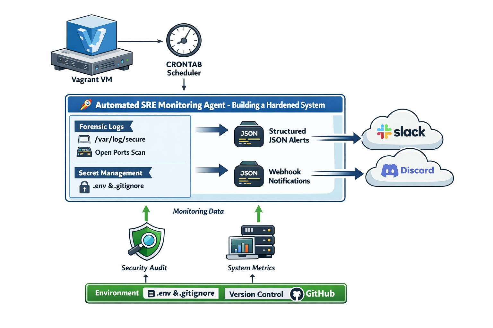
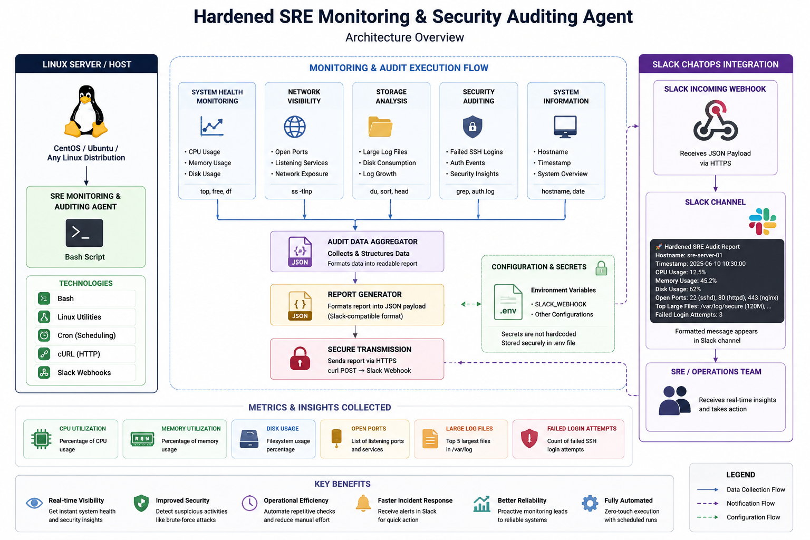
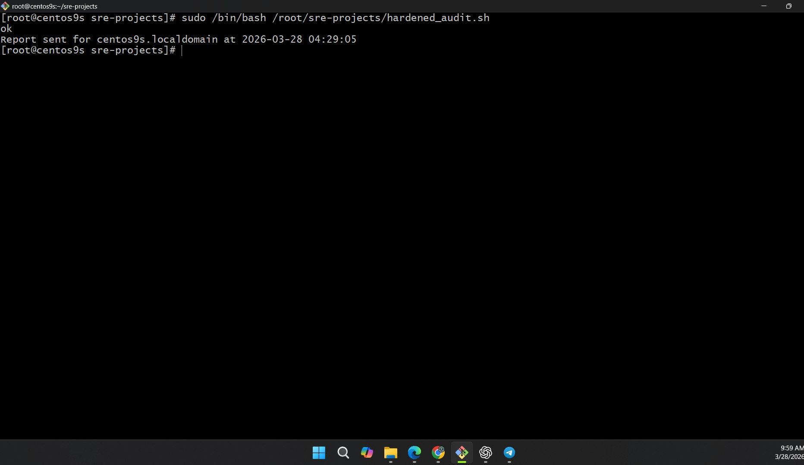
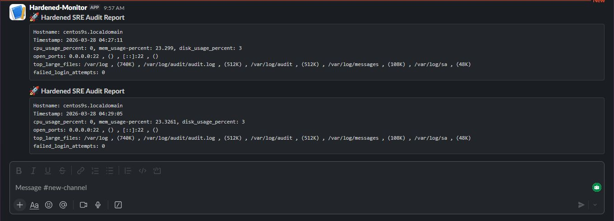
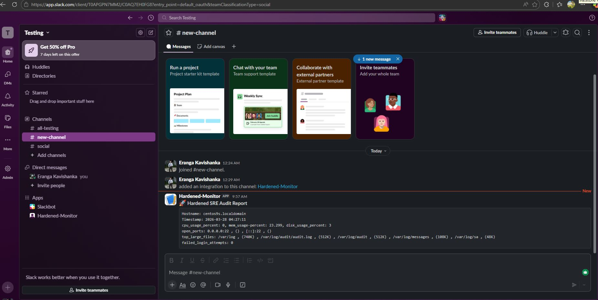

# Hardened SRE Monitoring & Security Auditing Agent

A lightweight Site Reliability Engineering (SRE) automation solution built with Bash scripting that performs automated Linux system audits, security checks, and delivers operational reports directly to Slack through ChatOps integration.

---

## High-Level Architecture

<p align="center">
  
</p>

<p align="center">
  <em>End-to-end workflow of the Hardened SRE Monitoring & Security Auditing Agent.</em>
</p>

---

## Overview

Modern infrastructure requires continuous monitoring, operational visibility, and security awareness. Manual server inspections are time-consuming, inconsistent, and difficult to scale.

This project automates infrastructure auditing by collecting critical system metrics, performing security-focused checks, generating operational reports, and sending real-time notifications directly to Slack using Incoming Webhooks.

The solution demonstrates core Site Reliability Engineering (SRE), DevOps, and DevSecOps concepts while promoting automation and operational excellence.

---

## Detailed Architecture

<p align="center">
  
</p>

<p align="center">
  <em>Detailed architecture showing monitoring components, security auditing modules, report generation, and Slack-based ChatOps integration.</em>
</p>

---

## Key Features

### Infrastructure Health Monitoring

- CPU utilization monitoring
- Memory utilization monitoring
- Disk usage monitoring
- Hostname collection
- Timestamped audit reports

### Network Auditing

- Open port detection
- Listening service identification
- Network exposure visibility

### Storage Analysis

- Large log file discovery
- Disk consumption auditing
- Log growth visibility

### Security Auditing

- Failed SSH login detection
- Authentication monitoring
- Basic security forensics

### ChatOps Integration

- Slack Incoming Webhook integration
- Automated notifications
- Real-time operational reporting
- Team-wide visibility

### Secure Configuration Management

- Environment variable support
- Externalized secrets management
- Secure webhook handling

---

## Technology Stack

### Operating System

- Linux (Ubuntu / CentOS)

### Scripting & Automation

- Bash

### Monitoring Utilities

- top
- free
- df
- ss

### Data Processing

- awk
- grep
- sed
- xargs

### Communication

- Slack Incoming Webhooks
- curl

### Configuration

- Environment Variables
- .env Files

---

## Project Structure

```text
SRE-SYSTEM-AUDITOR
│
├── images
│   ├── highlevel.png
│   └── architecture.png
│
├── screenshots
│   ├── image.png
│   ├── 2.png
│   └── slack_ss.png
│
├── hardened_audit.sh
├── .gitignore
└── README.md
```

---

## Workflow

1. The Bash Monitoring Agent executes on a Linux server.
2. System metrics are collected.
3. Security audits are performed.
4. Audit information is aggregated.
5. A structured JSON payload is generated.
6. The payload is sent to Slack through a secure webhook.
7. Operations and SRE teams receive real-time visibility into system health and security status.

---

## Metrics Collected

| Category | Metrics |
|-----------|----------|
| Compute | CPU Usage |
| Compute | Memory Usage |
| Storage | Disk Usage |
| Network | Open Listening Ports |
| Logging | Largest Log Files |
| Security | Failed Login Attempts |
| System | Hostname & Timestamp |

---

## Screenshots

### System Audit Execution

The monitoring agent executes automated health checks and security audits on the Linux host.

<p align="center">
  
</p>

---

### Monitoring & Audit Results

Collected infrastructure metrics including CPU usage, memory utilization, disk consumption, open ports, and security insights.

<p align="center">
  
</p>

---

### Slack ChatOps Notification

Generated audit reports are automatically delivered to Slack, enabling real-time visibility for operations and SRE teams.

<p align="center">
  
</p>

---

## Security Features

### Secret Management

Webhook URLs are stored securely through environment variables rather than being hardcoded into the application.

### Authentication Monitoring

Detects failed SSH authentication attempts to improve security visibility.

### Network Exposure Analysis

Identifies active listening ports and exposed services.

### Operational Auditing

Generates timestamped reports to support troubleshooting and incident investigations.

---

## DevOps, DevSecOps & SRE Concepts Demonstrated

- Site Reliability Engineering (SRE)
- Infrastructure Monitoring
- Security Auditing
- Linux Administration
- Bash Automation
- ChatOps
- Observability Fundamentals
- DevSecOps Practices
- Operational Excellence
- Incident Awareness

---

## Learning Outcomes

This project provided practical experience in:

- Linux Internals
- Monitoring Automation
- Security Auditing
- Infrastructure Reliability
- ChatOps Workflows
- Bash Scripting
- DevOps Engineering
- Site Reliability Engineering
- DevSecOps Principles

---

## Future Improvements

- Prometheus Metrics Exporter
- Grafana Dashboards
- Threshold-Based Alerting
- Multi-Server Monitoring
- Docker Containerization
- Kubernetes Node Auditing
- Centralized Logging
- Automated Incident Escalation
- Self-Healing Workflows

---

## Author

**Eranga Kavishanka**

Software Engineering Undergraduate

DevOps | Cloud | SRE Enthusiast

AWS Student Builder Group USJ – Technical Lead

---

⭐ If you found this project interesting, feel free to star the repository and provide feedback.